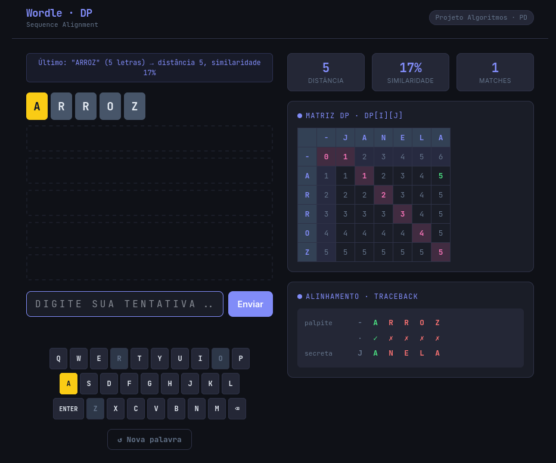
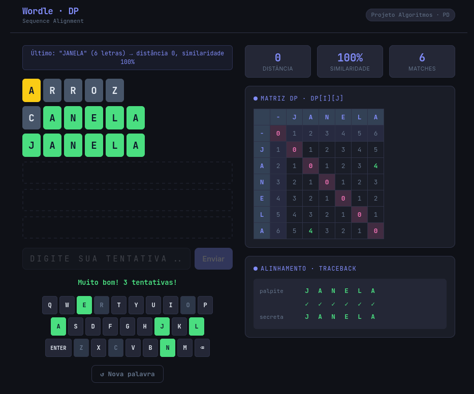

# Wordle com Sequence Alignment

**Número da Lista**: 06 <br>
**Conteúdo da Disciplina**: Programação Dinâmica <br>

## Alunos

| Matrícula | Aluno |
| --- | --- |
| 2310011810 | Rodrigo Ferreira do Amaral |

## Sobre

O **Wordle com Sequence Alignment** é um jogo de palavras estilo Wordle construído para demonstrar o funcionamento do algoritmo de **Alinhamento de Sequências** com a estratégia de **Programação Dinâmica** em tempo real.

O jogador tem 6 tentativas para descobrir uma palavra secreta de 5 letras. A cada palpite, o algoritmo de Sequence Alignment compara a palavra digitada com a palavra secreta, calcula a distância de edição mínima e exibe visualmente a matriz DP resultante, incluindo o caminho do traceback destacado.

O projeto permite visualizar cada etapa do algoritmo: a matriz dp[i][j] completa, o caminho ótimo do traceback, o alinhamento textual entre as duas palavras e as métricas de distância e similaridade calculadas a cada tentativa.

## Screenshots





## Instalação

**Linguagem:** HTML5 + JavaScript
**Pré-requisitos:** Python 3 para rodar um servidor local simples.

```bash
git clone https://github.com/projeto-de-algoritmos-2026/G06_Programacao-Dinamica_PA-26.1
cd G06_Programacao-Dinamica_PA-26.1
```

## Execução

O projeto deve ser aberto por um servidor local, não por `file://`, para garantir o carregamento correto dos arquivos JavaScript e CSS.

### Opção 1: script de inicialização

```bash
bash start.sh
```

Depois, abra o endereço exibido no terminal, normalmente `http://localhost:8000`.

No Windows, execute:

```bat
start.bat
```

### Opção 2: comando manual

```bash
python3 -m http.server 8000
```

Se o seu sistema usar `python` no lugar de `python3`, o script já tenta esse fallback automaticamente. No Windows, o `start.bat` tenta `py -3` primeiro e depois `python`.

## Uso

1. Ao abrir o arquivo, o jogo sorteia automaticamente uma palavra secreta de 5 letras.
2. Digite um palpite no campo de texto e pressione **Enviar** ou **Enter**.
3. As letras do tabuleiro recebem cores conforme o resultado do alinhamento:
   - **Verde** — letra na posição correta (match).
   - **Amarelo** — letra presente na palavra, mas em posição errada.
   - **Cinza** — letra ausente na palavra secreta.
4. A cada tentativa, a **matriz DP** é atualizada na coluna direita, com o caminho do traceback destacado em rosa.
5. O painel de **Alinhamento** exibe as duas palavras alinhadas com os símbolos `✓` (match), `✗` (mismatch) e `·` (gap).
6. Use o teclado virtual ou o teclado físico para digitar. O botão **↺ Nova palavra** reinicia o jogo a qualquer momento.

## Legenda de cores

| Cor | Significado |
| --- | --- |
| 🟩 Verde | Letra na posição exata (match) |
| 🟨 Amarelo | Letra presente em outra posição |
| ⬜ Cinza | Letra ausente na palavra secreta |
| 🟣 Rosa | Caminho do traceback na matriz DP |

## Outros

**Conceitos de Programação Dinâmica aplicados:**

- **Subestrutura ótima:** o custo mínimo de alinhar `s1[0..i]` com `s2[0..j]` depende apenas dos subproblemas `dp[i-1][j-1]`, `dp[i-1][j]` e `dp[i][j-1]`, já resolvidos e armazenados na matriz.
- **Sobreposição de subproblemas:** sem memoização, as mesmas comparações seriam refeitas exponencialmente; a matriz DP garante que cada célula é calculada exatamente uma vez.
- **Recorrência:** `dp[i][j] = min(dp[i-1][j-1] + custo, dp[i-1][j] + 1, dp[i][j-1] + 1)`, com complexidade **O(m × n)** em tempo e espaço.
- **Traceback:** após preencher a matriz, o caminho ótimo é reconstruído de `dp[m][n]` até `dp[0][0]`, revelando a sequência de operações (match, mismatch, gap) que produz o alinhamento mínimo.
